# 🎼 Symphony
### *A Decentralized Multi-Agent Framework for Edge Devices with Beacon-Guided Task Routing and CoT Voting*


*🚀 Democratizing AI through decentralized multi-agent collaboration on consumer-grade devices*

[**📚 Documentation**](docs/) | [**🚀 Quick Start**](#quick-start) | [**💡 Examples**](examples/) | [**📝 Paper**](#citation) | [**🤝 Contributing**](#contributing)

</div>

---

## 🌟 Overview

**Symphony** is a groundbreaking decentralized multi-agent framework that enables intelligent agents to collaborate seamlessly across heterogeneous edge devices. Unlike traditional centralized LLM-based agent systems that require expensive server-grade GPUs, Symphony democratizes AI by orchestrating lightweight models on consumer-grade hardware (RTX 3060/4090, Jetson boards, M-series Apple devices) through innovative beacon-guided task routing and Chain-of-Thought (CoT) voting mechanisms.

## 🎬 Demo

See Symphony in action! Watch our comprehensive demo showcasing the decentralized multi-agent collaboration:


*The demo illustrates key features including task decomposition, beacon-guided routing, agent collaboration, and CoT voting mechanisms across multiple edge devices.*

### 🎯 Key Value Propositions

- **💰 Cost-Effective**: Run on consumer-grade GPUs instead of expensive server hardware
- **⚡ Scalable**: Dynamically expand agent networks without infrastructure bottlenecks
- **🧠 Intelligent**: Achieve superior reasoning through CoT voting and capability matching
- **🌐 Accessible**: Deploy across diverse devices and network topologies

## ✨ Key Features

### 🏗️ **Decentralized Architecture**
- **Trustless Coordination**: No central orchestrator required
- **Fault Tolerance**: Resilient to individual node failures  
- **Network Flexibility**: Support for both intranet and public internet deployment

### 🎯 **Intelligent Task Distribution**
- **Beacon-Based Routing**: Efficient capability-aware task allocation
- **Dynamic Matching**: Real-time agent selection based on expertise and availability
- **Load Balancing**: Optimal resource utilization across heterogeneous devices

### 🧠 **Advanced Reasoning**
- **Multi-Path CoT**: Parallel chains-of-thought for robust problem solving
- **Majority Voting**: Reliability-weighted consensus mechanisms
- **Task Decomposition**: Automatic breakdown of complex problems into executable sub-tasks

### 🔧 **Edge-Optimized**
- **Lightweight Models**: Optimized for consumer-grade hardware
- **Local Processing**: Minimize bandwidth and latency requirements
- **Resource Efficiency**: Intelligent model loading and memory management

### 🔗 **Flexible Communication**
- **ISEP Integration**: Standardized intelligent service exchange
- **Multi-Topology Support**: Global broadcast and neighbor-based communication

## 🏗️ Architecture Overview

Symphony employs a three-stage pipeline that integrates decentralized coordination with intelligent task execution:

```mermaid
graph TB
    subgraph "📋 Planning Phase"
        U[👤 User Query] --> PA[🧠 Planning Agents]
        PA --> T1[📝 Task Decomposition 1]
        PA --> T2[📝 Task Decomposition 2] 
        PA --> T3[📝 Task Decomposition 3]
    end
    
    subgraph "⚡ Execution Phase"
        T1 --> B1[📡 Beacon Broadcast]
        T2 --> B2[📡 Beacon Broadcast]
        T3 --> B3[📡 Beacon Broadcast]
        
        B1 --> CM[🎯 Capability Matching]
        B2 --> CM
        B3 --> CM
        
        CM --> E1[🤖 Agent Execution 1]
        CM --> E2[🤖 Agent Execution 2]
        CM --> E3[🤖 Agent Execution 3]
    end
    
    subgraph "🗳️ Voting Phase"
        E1 --> V[📊 CoT Voting]
        E2 --> V
        E3 --> V
        V --> R[✅ Final Result]
    end
    
    style U fill:#e1f5fe
    style R fill:#e8f5e8
```



### Core Components

- **🗂️ Decentralized Ledger**: Tracks agent capabilities, contributions, and reputation
- **🖥️ Worker Nodes**: Edge devices with local LLM engines and specialized prompts  
- **🚪 Gateways**: Standardized APIs for registration and inter-agent messaging
- **📡 Communicator**: Secure, efficient messaging across network topologies

## 📦 Installation

```bash
# Clone the repository
git clone https://github.com/your-org/symphony.git
cd symphony

# Create virtual environment
python -m venv venv
source venv/bin/activate  # On Windows: venv\Scripts\activate

# Install dependencies
pip install -r requirements.txt

# Install in development mode
pip install -e .
```

## 🚀 Quick Start

### 1. Agent Registration

Start a compute agent node:

```python
# agent_register.py
from symphony import Agent
from symphony.runtime.config import load_config

# Load agent configuration
config = load_config("config_agent1.yaml")

# Initialize and register agent
agent = Agent(
    node_id="agent_001",
    capabilities=["text-generation", "reasoning", "math"],
    config=config
)

# Start the agent
agent.start()
print(f"🤖 Agent {agent.node_id} is now online and ready to collaborate!")
```

### 2. User Registration

Submit tasks to the Symphony network:

```python
# user_register.py
from symphony import User
from symphony.runtime.config import load_config

# Load user configuration  
config = load_config("config_user.yaml")

# Initialize user client
user = User(
    node_id="user_001",
    config=config
)

# Connect to the network
user.connect()

# Submit a complex reasoning task
task = """
Analyze the environmental impact of renewable energy adoption in developing countries. 
Consider economic factors, technological challenges, and policy implications.
Provide a comprehensive assessment with actionable recommendations.
"""

result = user.submit_task(task)
print(f"📊 Task completed! Result: {result}")
```

### 3. Configuration Example

```yaml
# config_agent1.yaml
node:
  id: "agent_001"
  type: "compute_provider"
  
model:
  path: "mistralai/Mistral-7B-Instruct-v0.3"
  device: "cuda:0"
  max_tokens: 512
  temperature: 0.7
  
capabilities:
  - "text-generation"
  - "mathematical-reasoning" 
  - "code-analysis"
  
network:
  host: "0.0.0.0"
  port: 8001
  neighbors:
    - "192.168.1.100:8002"
    - "192.168.1.101:8003"
    
storage:
  lora_path: "./lora_cache"
  memory_limit: "8GB"
```

## 📖 Detailed Usage

### Multi-Agent Task Execution

```python
from symphony.agents.agent import Agent
from symphony.protocol.task_contract import Task
from symphony.core.capability import CapabilityManager

# Initialize multiple specialized agents
math_agent = Agent(
    node_id="math_specialist",
    capabilities=["mathematical-reasoning", "calculus", "statistics"]
)

code_agent = Agent(
    node_id="code_specialist", 
    capabilities=["code-generation", "debugging", "optimization"]
)

research_agent = Agent(
    node_id="research_specialist",
    capabilities=["web-search", "data-analysis", "summarization"]
)

# Create a complex task requiring multiple specialties
complex_task = Task(
    description="Build a machine learning model to predict stock prices using financial data",
    requirements=["data-collection", "mathematical-modeling", "code-implementation"],
    context={"domain": "finance", "complexity": "high"}
)

# The framework automatically:
# 1. Decomposes the task into specialized sub-tasks
# 2. Broadcasts beacons to find suitable agents
# 3. Routes sub-tasks to best-matching specialists
# 4. Aggregates results through CoT voting

result = symphony.execute_task(complex_task)
```

### Custom Capability Matching

```python
from symphony.core.capability import CapabilityManager

# Create custom capability manager
cm = CapabilityManager([
    "natural-language-processing",
    "computer-vision", 
    "time-series-analysis",
    "recommendation-systems"
])

# Add new agent capabilities dynamically
cm.add_capability("multimodal-reasoning")

# Find best agents for specific requirements
task_requirements = ["computer-vision", "natural-language-processing"]
matches = cm.match_and_filter(task_requirements, threshold=0.8)

print(f"🎯 Found {len(matches)} agents matching requirements")
```

## ⚙️ Configuration Guide

### Network Topologies

Symphony supports multiple network configurations:

#### 1. Global Broadcast (Fully Connected)
```yaml
network:
  topology: "global_broadcast"
  discovery_method: "multicast"
  broadcast_port: 5555
```

#### 2. Neighbor Broadcast (P2P)
```yaml
network:
  topology: "neighbor_broadcast"
  neighbors:
    - host: "192.168.1.100"
      port: 8001
      capabilities: ["math", "reasoning"]
    - host: "192.168.1.101"  
      port: 8002
      capabilities: ["vision", "nlp"]
```

### Model Configuration

```yaml
model:
  # Supported models
  name: "mistralai/Mistral-7B-Instruct-v0.3"  # or "deepseek-ai/deepseek-llm-7b-chat"
  
  # Optimization settings
  quantization: "int8"  # int4, int8, fp16
  max_memory: "8GB"
  device_map: "auto"
  
  # Inference parameters
  generation:
    max_tokens: 512
    temperature: 0.5
    top_p: 0.9
    do_sample: true
    
  # LoRA settings for distributed training
  lora:
    r: 16
    alpha: 32
    dropout: 0.1
    target_modules: ["q_proj", "v_proj"]
```

### Capability Profiles

Define agent specializations:

```yaml
capabilities:
  # Core reasoning abilities
  reasoning:
    - "logical-reasoning"
    - "mathematical-reasoning" 
    - "causal-reasoning"
  
  # Domain expertise  
  domains:
    - "healthcare"
    - "finance"
    - "legal-analysis"
    
  # Technical skills
  technical:
    - "code-generation"
    - "data-analysis"
    - "system-administration"
    
  # Language support
  languages:
    - "english"
    - "chinese"
    - "spanish"
```

## 🔌 API Reference

### Core Classes

#### `Agent`
The main agent implementation for task execution.

```python
class Agent:
    def __init__(self, node_id: str, capabilities: List[str], config: Dict):
        """Initialize agent with capabilities and configuration."""
        
    def register(self) -> bool:
        """Register agent with the network."""
        
    def assign_task(self, task: Task) -> TaskResult:
        """Execute assigned task and return result."""
        
    def _decompose_task(self, task: Task) -> List[SubTask]:
        """Decompose complex task into executable sub-tasks."""
```

#### `User`
User interface for submitting tasks to the network.

```python
class User:
    def __init__(self, node_id: str, config: Dict):
        """Initialize user client."""
        
    def submit_task(self, description: str, **kwargs) -> TaskResult:
        """Submit task for distributed execution."""
        
    def get_task_status(self, task_id: str) -> TaskStatus:
        """Check status of submitted task."""
```

#### `CapabilityManager`
Manages agent capabilities and matching.

```python
class CapabilityManager:
    def match(self, requirement: str, threshold: float = 0.7) -> List[float]:
        """Match requirement against registered capabilities."""
        
    def add_capability(self, capability: str) -> None:
        """Add new capability to the manager."""
        
    def match_and_filter(self, requirements: List[str], threshold: float) -> List[Tuple[int, float]]:
        """Find and filter agents meeting requirements."""
```

### Protocol Messages

#### `Task`
Represents a distributed computation task.

```python
@dataclass
class Task:
    task_id: str
    description: str
    requirements: List[str]
    context: Dict[str, Any]
    subtask_id: int = 0
    steps: List[str] = None
    previous_results: List[str] = None
```

#### `Beacon`
Service discovery and capability advertisement.

```python
@dataclass  
class Beacon:
    beacon_id: str
    source_id: str
    task_requirements: List[str]
    ttl: int = 5
    context: Dict[str, Any] = None
```

## 🤝 Contributing

We welcome contributions from the community! Symphony is designed to be an open, collaborative platform for advancing decentralized AI research.

## 🤝 Contact

If you are interested in our research, please contact tianyu@gradient.network. 


## 📝 Citation

If you use Symphony in your research or projects, please cite our paper:

```bibtex
@article{wang2024symphony,
  title={Symphony: A Decentralized Multi-Agent Framework on Edge Devices with Beacon-Guided Task Routing and CoT Voting},
  author={Wang, Ji and Chen, Kashing and Song, Xinyuan and Ai, Lynn and Yang, Eric and Zhang, Ke and Shi, Bill},
  journal={arXiv preprint arXiv:2024.xxxx},
  year={2024}
}
```

---

<div align="center">

**🚀 Ready to build the future of decentralized AI?**

[Get Started](docs/getting-started.md) | [Join Our Community](https://discord.gg/symphony-ai) | [Follow Updates](https://twitter.com/symphony_ai)


</div>
